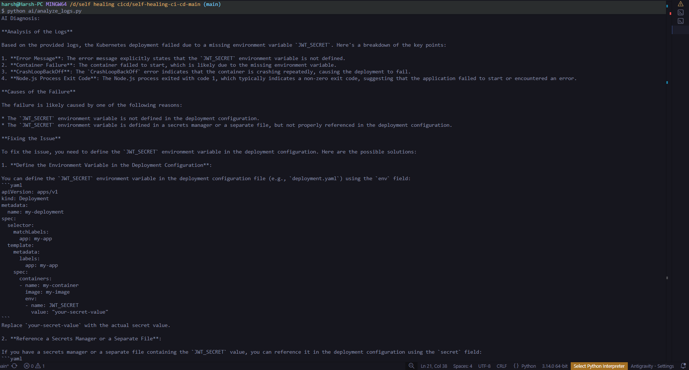

# 🚀 AI-Powered Self-Healing CI/CD for Microservices

<p align="center">
  
  
  
  
  
  
  
  
  
</p>

<p align="center">
  A production-grade DevOps platform featuring <strong>AI-assisted debugging</strong> and <strong>self-healing infrastructure</strong> for a microservices application deployed on AWS EKS.
</p>

---

## 📖 Overview

This project implements a full end-to-end DevOps platform that automatically **builds**, **deploys**, **monitors**, and **self-recovers** microservices when failures occur. It combines modern cloud engineering with AI-powered diagnostics to simulate real-world production operations.

**What it demonstrates:**
- ☁️ Infrastructure as Code with Terraform
- 🐳 Container orchestration with Kubernetes (EKS)
- ⚙️ Fully automated CI/CD pipelines
- 📊 Observability with Prometheus + Grafana
- 🔐 Security best practices (IRSA, Network Policies, Secrets)
- 🤖 AI-assisted deployment failure analysis
- 🔄 Automatic rollback on pod failure

---

## 🏗️ System Architecture

```
Developer Push
      │
      ▼
GitHub Actions CI/CD
      │
      ├── Build Docker Images
      ├── Push to AWS ECR
      └── Deploy to Kubernetes
                │
                ▼
          AWS EKS Cluster
                │
     ┌──────────┼──────────┐
     │          │          │
Catalog     Auth        Monitoring
Service    Service    (Prometheus)
     │          │
     └────┬─────┘
          ▼
   Grafana Dashboards
```

**On deployment failure:**
```
Failure Detected
      │
      ▼
AI Log Analyzer (Groq LLM)
      │
      ▼
Root Cause Diagnosis
      │
      ▼
Self-Healing Controller
      │
      ▼
Automatic Rollback → Last Stable State
```

---

## ✨ Features

### 📦 Microservices

| Service | Description | Port |
|---|---|---|
| **Catalog Service** | Car marketplace REST API | `3000` |
| **Auth Service** | Authentication & JWT verification | `4000` |
| **Frontend** | React + Vite UI | `5173` |

### ☁️ Infrastructure as Code

Fully provisioned with **Terraform**:
- AWS VPC + Subnets
- EKS Cluster + Node Groups
- IAM Roles (IRSA)
- ECR Container Registry

### ⚙️ CI/CD Pipeline

Powered by **GitHub Actions** — every push triggers:

```
Build → Push to ECR → Deploy to EKS → Verify Rollout
```

Images are tagged with commit SHA for full traceability:
```
catalog-service:3f9c2ab
auth-service:3f9c2ab
```

### 📊 Observability

| Tool | Purpose |
|---|---|
| **Prometheus** | Metrics collection |
| **Grafana** | Visual dashboards |

Metrics tracked: Pod CPU & memory, node health, deployment performance.

### 🔐 Security Hardening

- **Kubernetes Secrets** — sensitive config management
- **IRSA** — IAM Roles for Service Accounts (no credentials in containers)
- **Network Policies** — restrict inter-pod communication
- **Pod Security Context** — least-privilege container execution

### 🤖 AI-Assisted Debugging

When a deployment fails, the pipeline automatically:

1. Fetches pod logs from Kubernetes
2. Sends logs to Groq LLM for analysis
3. Returns a human-readable root cause diagnosis

**Example AI output:**
```
AI Diagnosis:
  The container failed because the JWT_SECRET environment
  variable is missing. Ensure the Kubernetes Secret is
  configured properly before redeploying.
```

### 🔄 Self-Healing Infrastructure

A Kubernetes controller continuously polls pod health. On detecting:
- `CrashLoopBackOff`
- `ImagePullBackOff`

It automatically executes:
```bash
kubectl rollout undo deployment/<service-name>
```
Restoring the last stable state — **zero human intervention required**.

---

## 📁 Project Structure

```
.
├── backend/
│   ├── catalog-service/        # Car marketplace API
│   └── auth-service/           # JWT authentication service
├── frontend/                   # React + Vite UI
│
├── k8s/
│   ├── catalog-deployment.yaml
│   ├── auth-deployment.yaml
│   ├── services.yaml
│   └── network-policy.yaml
│
├── infra/
│   └── terraform/              # AWS infrastructure definitions
│
├── ai/
│   └── analyze_logs.py         # LLM-based log analyzer
│
├── self-healing-agent/
│   ├── monitor.py              # Pod health controller
│   └── Dockerfile
│
└── .github/
    └── workflows/
        └── deploy.yml          # CI/CD pipeline
```

---

## 🛠️ Tech Stack

| Category | Tools |
|---|---|
| **Frontend** | React + Vite |
| **Backend** | Node.js + Express |
| **Containers** | Docker |
| **Orchestration** | Kubernetes (AWS EKS) |
| **Cloud** | AWS (VPC, ECR, EKS, IAM) |
| **Infrastructure** | Terraform |
| **CI/CD** | GitHub Actions |
| **Monitoring** | Prometheus + Grafana |
| **AI** | Groq LLM |

---

## ▶️ Running Locally

**Start all services with Docker Compose:**
```bash
docker compose up --build
```

**Access the services:**

| Service | URL |
|---|---|
| Frontend | http://localhost:5173 |
| Catalog API | http://localhost:3000/api/cars |
| Auth Service | http://localhost:4000 |

**Example API response:**
```json
{
  "data": [
    { "id": 1, "name": "Tesla Model S", "price": 80000 },
    { "id": 2, "name": "BMW M4", "price": 75000 }
  ]
}
```

---

## 🚀 Deploying to AWS

**1. Provision infrastructure:**
```bash
cd infra/terraform
terraform init
terraform apply
```

**2. Deploy Kubernetes manifests:**
```bash
kubectl apply -f k8s/
```

**3. Verify pods are running:**
```bash
kubectl get pods
kubectl get services
```

---

## 🧪 Self-Healing Flow

```
New deployment pushed
        ↓
Pod enters CrashLoopBackOff / ImagePullBackOff
        ↓
Self-healing agent detects failure
        ↓
AI analyzes pod logs → Root cause identified
        ↓
Automatic rollback triggered
        ↓
✅ System restored to last stable state
```

---

## 📸 Screenshots


### 🤖 AI Diagnosis Output



---

## 🔮 Future Improvements

- [ ] GitOps deployment with **ArgoCD**
- [ ] Distributed tracing with **OpenTelemetry**
- [ ] **Canary deployments** for safer rollouts
- [ ] **Chaos engineering** tests (Chaos Monkey / LitmusChaos)
- [ ] Slack/PagerDuty alerts on self-healing events

---

## 👨‍💻 Author

**Harsh Ranjan** — Computer Science Engineering Student

---

<p align="center">
  If you found this project useful, consider giving it a ⭐ on GitHub!
</p>
